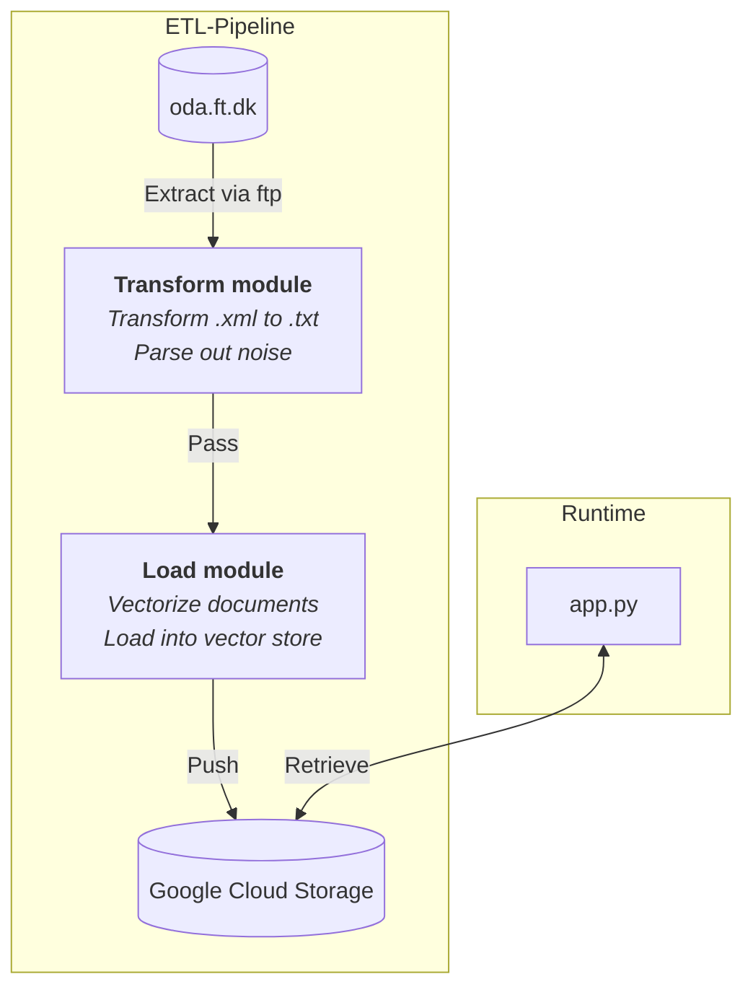

# Folketinget GPT


## Usage 
Try out the app on Huggingface: https://huggingface.co/spaces/nshern/ft_gpt.

## Install
Or host the app locally using poetry.
```
git clone https://github.com/nshern/ft_gpt.git
cd ft_gpt
poetry install
poetry streamlit run app.py 

```
Or with pip.
```
git clone https://github.com/nshern/ft_gpt.git
cd ft_gpt
pip install -r requirements.txt
streamlit run app.py 
```
Or run in a Docker container.
```
git clone https://github.com/nshern/ft_gpt.git
cd ft_gpt
docker run -p 8501:8501 -e OPENAI_API_KEY=[YOUR KEY] ft_gpt

```

## Architecture
The ETL pipeline is run asynchronous of runtime

